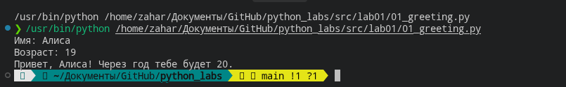
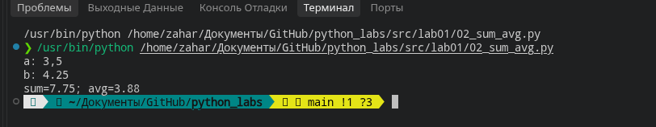
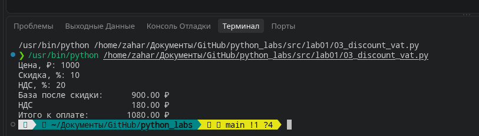
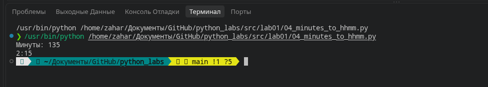
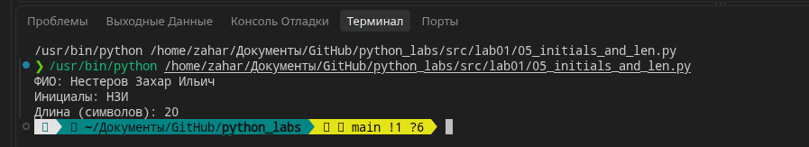
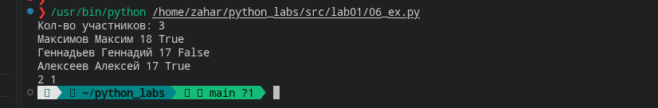
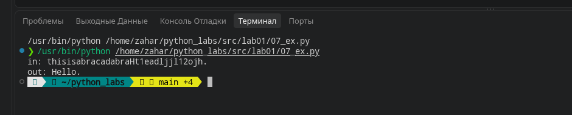

# ЛР1 - Ввод/вывод и форматирование
##задание 1
Ввод имени и возраста, вывод через f строку 
 

##задание 2
Ввод 2 чисел + замена запятой на точку (для питона). Вывод через f строку

##задание 3
Ввод цены скидки и ндс далее расчет по формулам из условия + вывод через f строку с округлением до 2 символов после запятой 

##задание 4
Ввод минут -> кол-во часов = целочисленное деление на 60, кол-во минут = остаток от деления на 60

##задание 5
Ввод ФИО. Далее разбиение на 3 слова, соответственно длина это длина 3 слов + 2 (2 пробела), инициалы это первый символ каждого слова

##задание 6
Ввод кол-ва участников затем цикл while, пока это кол-во не 0. Информация об участнике вводится как список, если последний элемент (булевое значение) True, то +1. 

##задание 7
Вводится код, проходимся циклом for по каждой букве пока не найдем заглавную из спика AL, затем берем оставшееся слово и берем из него каждый 3 символ. складываем все символы (включая заглавную букву) в строку и выводим.

