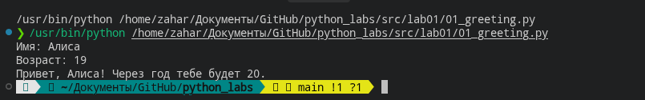
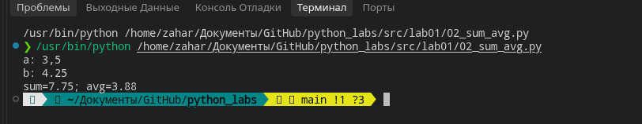
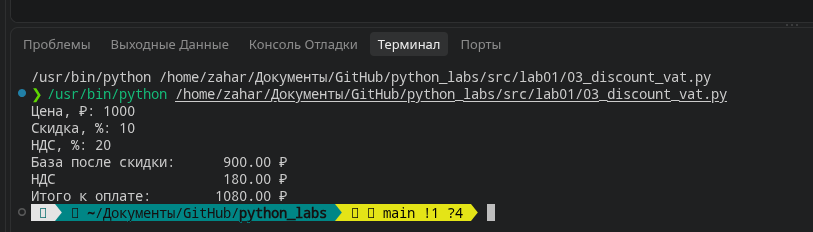
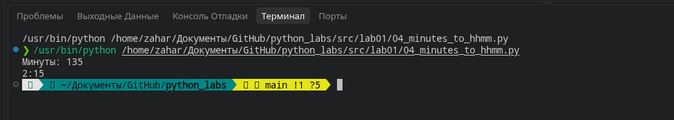
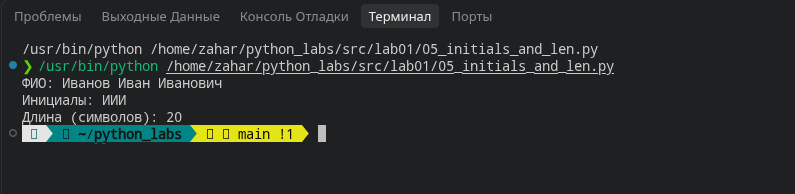
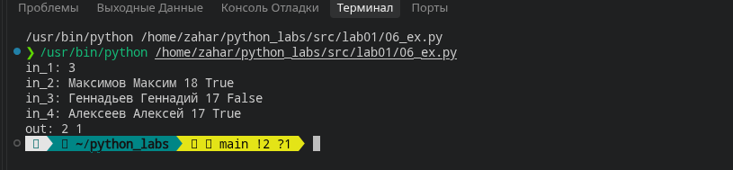
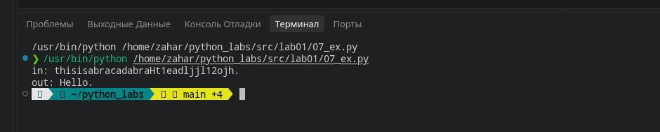

# ЛР1 - Ввод/вывод и форматирование

## Задание 1

### Код

```python
name = input("Имя: ")
age = int(input("Возраст: "))
print(f"Привет, {name}! Через год тебе будет {age + 1}.")
```

### Вывод



### Краткое описание

Программа запрашивает имя и возраст пользователя, после чего выводит приветствие и возраст пользователя через год.

## Задание 2

### Код

```python
a = float(input("a: ").replace(",", "."))
b = float(input("b: ").replace(",", "."))
print(f"sum={a+b:.2f}; avg={(a+b)/2:.2f}")
```

### Вывод



### Краткое описание

Программа принимает два числа, допускает ввод дробной части через запятую, а затем выводит их сумму и среднее арифметическое с точностью до двух знаков после запятой.

## Задание 3

### Код

```python
price = float(input("Цена, ₽: "))
discount = float(input("Скидка, %: "))
vat = float(input("НДС, %: "))

base = price * (1 - discount/100)
vat_amount = base * (vat/100)
total = base + vat_amount

print(f"База после скидки:  {base:>10.2f} ₽")
print(f"НДС                 {vat_amount:>10.2f} ₽")
print(f"Итого к оплате:     {total:>10.2f} ₽")
```

### Вывод



### Краткое описание

Программа запрашивает цену, размер скидки и ставку НДС. Затем она вычисляет стоимость после скидки, сумму НДС и итоговую стоимость, форматируя денежные значения до двух знаков после запятой.

## Задание 4

### Код

```python
m = int(input("Минуты: "))
print(f"{m // 60}:{m % 60:02d}")
```

### Вывод



### Краткое описание

Программа переводит заданное количество минут в формат `часы:минуты`. Часы определяются целочисленным делением на 60, а минуты — остатком от деления.

## Задание 5

### Код

```python
FIO = input("ФИО: ")

lenth = sum([len(i) for i in FIO.split()]) + 2
initials = [i[0] for i in FIO.split()]

print(f"Инициалы: {"".join(initials)}")
print(f"Длина (символов): {lenth}")
```

### Вывод



### Краткое описание

Программа разбивает введённые ФИО на отдельные слова, формирует инициалы из первых букв и определяет общую длину строки с учётом двух пробелов.

## Задание 6

### Код

```python
N = int(input("in_1: "))
N1 = N
k = 0
while N > 0 :
    s1 = input(f'in_{N1-N+2}: ').split()
    if s1[-1] == 'True':
        k +=1
    N = N - 1
print("out:", k, N1-k)
```

### Вывод



### Краткое описание

Программа запрашивает количество участников и сведения о каждом из них. По последнему значению в каждой введённой строке она подсчитывает количество записей со значениями `True` и `False`.

## Задание 7

### Код

```python
s = input("in: ")
AL = 'QWERTYUIOPASDFGHJKLZXCVBNM'
k = ''
for i in range(len(s)):
    if s[i] in AL:
        s = s[i:]
        for i1 in range(len(s)):
            if i1 % 3 == 0:
                k += s[i1]

        break

print(f'out: {k}')
```

### Вывод



### Краткое описание

Программа находит в строке первую заглавную латинскую букву, рассматривает остаток строки начиная с неё и формирует результат из каждого третьего символа.

