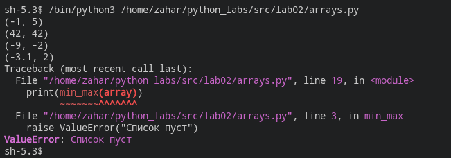
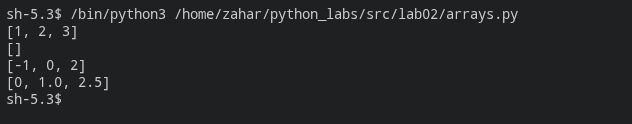
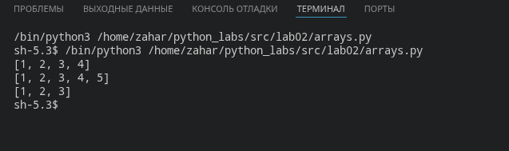
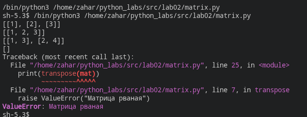
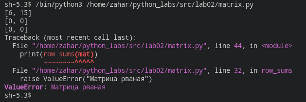
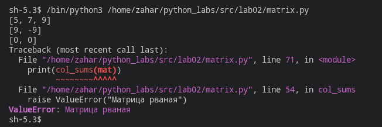
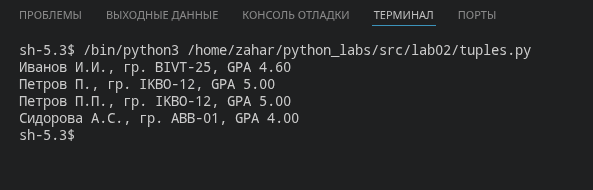

# ЛР2 - Коллекции и матрицы (list/tuple/set/dict)

## Задание 1 — Списки

### min_max

#### Код

```python
def min_max(nums: list[float | int]) -> tuple[float | int, float | int]:
    if len(nums) == 0:
        raise ValueError("Cписок пуст")
    min_num = nums[0]
    max_num = nums[0]
    for i in nums:
        if i > max_num: max_num = i
        if i < min_num: min_num = i
    return min_num, max_num
```

#### Проверочные списки

```python
test_array_1 = [
    [3, -1, 5, 5, 0],
    [42],
    [-5, -2, -9],
    [1.5, 2, 2.0, -3.1],
    [] #для удобства и ошибки(raisevalue) пустой список был пермещен в конец вывода
]
```

#### Вывод



#### Краткое описание

Функция возвращает минимальное и максимальное значения списка в виде кортежа. Для пустого списка вызывается ValueError.

### unique_sorted

#### Код

```python
def unique_sorted(nums: list[float | int]) -> list[float | int]:
    nums = list(set(nums))
    for i in range(len(nums)):
        for j in range(len(nums)-1):
            if nums[j] > nums[j+1] : nums[j], nums[j+1] = nums[j+1], nums[j]
    return nums
```

#### Проверочные списки

```python
test_array_2 = [
    [3, 1, 2, 1, 3],
    [],
    [-1, -1, 0, 2, 2],
    [1.0, 1, 2.5, 2.5, 0]
]
```

#### Вывод



#### Краткое описание

Функция удаляет повторяющиеся значения с помощью множества и сортирует список по возрастанию пузырьковой сортировкой.

### flatten

#### Код

```python
def flatten(mat: list[list | tuple]) -> list:
    s = []
    for i in mat:
        if type(i) == list or type(i) == tuple: 
            for j in i:
                s.append(j)
        else:
            raise TypeError("Элемент не является списком/кортежем")
    return s
```

#### Проверочные списки

```python
test_array_3 = [
    [[1, 2], [3, 4]],
    [[1, 2], (3, 4, 5)],
    [[1], [], [2, 3]],
    #[[1, 2], "ab"]
]
```

#### Вывод



#### Краткое описание

Функция объединяет вложенные списки и кортежи в один список, сохраняя порядок элементов по строкам. Если строка не является списком или кортежем, вызывается TypeError.

## Задание 2 — Матрицы

### transpose

#### Код

```python
def transpose(mat: list[list[float | int]]) -> list[list]:
    if len(mat) == 0:
        return []
    for row in mat:
        if len(row) != len(mat[0]):
            raise ValueError("Матрица рваная")

    transpose_mat = []
    for i in range(len(mat[0])):
        new_row = []
        for j in range(len(mat)):
            new_row.append(mat[j][i])
        transpose_mat.append(new_row)
    return transpose_mat
```

#### Проверочные списки

```python
test_array_1 = [
    [[1, 2, 3]],
    [[1], [2], [3]],
    [[1, 2], [3, 4]],
    [],
    [[1, 2], [3]]
]
```

#### Вывод



#### Краткое описание

Функция меняет строки и столбцы матрицы местами. Для пустой матрицы возвращается пустой список. Если строки имеют разную длину, вызывается ValueError.

### row_sums

#### Код

```python
def row_sums(mat: list[list[float | int]]) -> list[float]:
    sums = []
    for row in mat:
        if len(row) != len(mat[0]):
            raise ValueError("Матрица рваная")
        sums.append(sum(row))
    return sums
```

#### Проверочные списки

```python
test_array_2 = [
    [[1, 2, 3], [4, 5, 6]],
    [[-1, 1], [10, -10]],
    [[0, 0], [0, 0]],
    [[1, 2], [3]],
]
```

#### Вывод



#### Краткое описание

Функция возвращает список сумм элементов каждой строки. Перед суммированием строки проверяется её длина. Для рваной матрицы вызывается ValueError.

### col_sums

#### Код

```python
def col_sums(mat: list[list[float | int]]) -> list[float]:
    sums = []
    if len(mat) == 0:
        return []

    for row in mat:
        if len(row) != len(mat[0]):
            raise ValueError("Матрица рваная")

    for j in range(len(mat[0])):
        s = 0
        for i in range(len(mat)):
            s += mat[i][j]
        sums.append(s)
    return sums
```

#### Проверочные списки

```python
test_array_3 = [
    [[1, 2, 3], [4, 5, 6]],
    [[-1, 1], [10, -10]],
    [[0, 0], [0, 0]],
    [[1, 2], [3]],
]
```

#### Вывод



#### Краткое описание

Функция возвращает список сумм элементов каждого столбца. Перед вычислением проверяется прямоугольность матрицы. Для пустой матрицы возвращается пустой список, для рваной — вызывается ValueError.

## Задание 3 — Кортежи

### format_record

#### Код

```python
StudentRecord = tuple[str, str, float]

def format_record(rec: StudentRecord) -> str:
    if type(rec) != tuple:
        raise TypeError('Запись rec должна быть кортежем')
    if len(rec) != 3:
        raise ValueError('Запись rec должна содержать ровно 3 элемента')
    if type(rec[0]) != str or type(rec[1]) != str or type(rec[2]) != float:
        raise TypeError('ФИО и группа должны быть строками, а GPA — числом типа float')
    if rec[0].strip() == '':
        raise ValueError('ФИО не должно быть пустым')
    if rec[1].strip() == '':
        raise ValueError('Группа не должна быть пустой')
    if not 0.0 <= rec[2] <= 5.0:
        raise ValueError('GPA должен быть в диапазоне от 0 до 5')

    fio_parts = rec[0].split()
    if len(fio_parts) < 2 or len(fio_parts) > 3:
        raise ValueError('ФИО должно состоять из 2 или 3 слов')
    group = " ".join(rec[1].split())
    gpa = rec[2]

    surname = fio_parts[0][0].upper() + fio_parts[0][1:]
    initials = "".join(part[0].upper() + "." for part in fio_parts[1:])
    return f"{surname} {initials}, гр. {group}, GPA {gpa:.2f}"
```

#### Проверочные списки

```python
test_array_1 = [
    ("Иванов Иван Иванович", "BIVT-25", 4.6),
    ("Петров Пётр", "IKBO-12", 5.0),
    ("Петров Пётр Петрович", "IKBO-12", 5.0),
    ("  сидорова  анна   сергеевна ", "ABB-01", 3.999),
]
```

#### Вывод



#### Краткое описание

Функция принимает запись студента в виде кортежа (ФИО, группа, GPA). Она убирает лишние пробелы, формирует инициалы в верхнем регистре и выводит GPA с двумя знаками после запятой. Проверяются типы элементов, количество слов в ФИО, непустая группа и диапазон GPA от 0 до 5.
